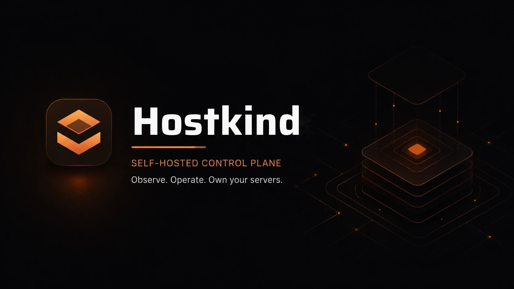

<div align="center">

# Hostkind

**A self-hosted control plane for servers and long-running processes.**

Runs on a single Node.js process, REST API + WebSocket, React frontend. No cloud, no external database, no API keys required.

[](LICENSE)
[](package.json)
[](#run-hostkind)

</div>



Hostkind is a self-hosted control plane for servers and long-running processes. It combines
process supervision, live consoles, health checks, metrics, file operations, backups,
schedules, users, roles, and an audit trail in one local web application.

It runs as a single Node.js process on Windows, Linux, and macOS. The backend serves a REST
API and WebSocket alongside a React single-page application. No cloud account, external
database, or API key is required.

---

## Features

|  |  |
| --- | --- |
| **Process supervision** | Register, start, stop, restart, and monitor multiple servers. |
| **Live consoles** | Stream console output and send commands over WebSocket. |
| **Metrics** | Track CPU, memory, disk, uptime, and module-specific health signals. |
| **File manager** | Browse and edit files with path-traversal protection and safety snapshots. |
| **Backups** | Create, download, restore, schedule, and retain backups. |
| **Schedules** | Run scheduled commands and maintenance actions. |
| **Users & roles** | Manage local users with admin and operator roles. |
| **Audit trail** | Record administrative and security-relevant activity in a local audit log. |
| **Crash recovery** | Track long-running operations in SQLite so interrupted work can be inspected or recovered. |

Most views target the active server, selectable from the Servers view or floating control
dock.

## Run Hostkind

On Windows, double-click `start-panel.bat`. On Linux or macOS:

```sh
./start-panel.sh
```

The launcher installs dependencies on first use, builds the frontend, creates local
configuration with a random signing secret, and starts the panel at
<http://localhost:2121>.

To run the individual steps yourself:

```sh
npm ci
npm run build
npm start
```

### Configuration

Hostkind creates `config.json` on first boot. To customise settings before starting,
copy `config.example.json` to `config.json` and edit it. The config contains the panel
address, users, servers, backup settings, schedules, and optional integrations. Secrets
and machine-specific paths are intentionally git-ignored.

### Reset to a fresh state

If you need to start Hostkind over, stop the panel and all game servers first, then run:

```sh
npm run reset
```

The default reset removes local credentials, configuration, application data, running state, metrics, runtimes, installer data, and supported caches. Registered server folders and backups are preserved.

To also remove registered server folders, pass `--include-servers`:

```sh
npm run reset -- --include-servers
```

Both modes require two exact confirmations. Server deletion uses a separate confirmation token. Use `--no-start` when you want to reset without launching the fresh panel process.

## Modules

Hostkind keeps process management generic and delegates workload-specific behavior to
modules. A module defines launch preparation, readiness detection, graceful shutdown,
console parsing, health checks, and optional content workflows.

### Minecraft

The included Minecraft module supports Vanilla, Paper, Spigot, Fabric, Forge, and NeoForge.
It can fetch current stable server versions from upstream sources, provision the appropriate
Java runtime, create or register servers, manage players and worlds, install compatible
Modrinth content, and coordinate safe world backups.

Minecraft-specific files, terminology, and defaults remain inside this module and its UI.

### Palworld

Hostkind can install the official Palworld dedicated server through SteamCMD on Windows
and Linux. It generates the administration credential, configures the official REST API,
connects to it only through loopback, reports Palworld health metrics, and exposes guarded
save, announcement, player-administration, and shutdown endpoints. Console, files,
backups, schedules, metrics, and watchdog supervision remain available if the REST API is
temporarily unavailable.

## Open edition

This repository is the open edition of Hostkind. Every feature is included and there is
no license activation or keys. This repo is generated from the private upstream
repository via a strip script, so changes land here as snapshots rather than as a
continuously synced fork.

## Releases

Publishing is automated upstream: every green CI run on the source repository
publishes a fresh snapshot to `main` here, and each tagged release (`vX.Y.Z`)
is mirrored to a GitHub Release on this repository with a zip archive, its
SHA256 checksum, and a full manifest. Verify a download with:

```
sha256sum -c hostkind-<version>.zip.sha256
```

## License

This repo is the open edition of Hostkind, licensed AGPL-3.0. A commercial license is
available for deployments that run ads or offer Hostkind as a managed service; contact
the author via <https://github.com/Riloox>.

AGPL-3.0 means you are free to use, modify, and distribute Hostkind. If you modify it
and distribute that version, you must share those modifications under the same AGPL-3.0
license. The full license text is in [`LICENSE`](LICENSE).

## Documentation

| Document | Purpose |
| --- | --- |
| [CONTRIBUTING.md](CONTRIBUTING.md) | Contribution guide and Developer Certificate of Origin |
| [THIRD_PARTY_NOTICES.md](THIRD_PARTY_NOTICES.md) | Asset provenance and third-party attributions |
| [OPERATIONS.md](OPERATIONS.md) | Operational guidance for running Hostkind in production |
| [UPGRADING.md](UPGRADING.md) | Upgrade instructions between releases |
| [CHANGELOG.md](CHANGELOG.md) | Release history and notable changes |

Copyright 2026 Federico Prunell Alza
